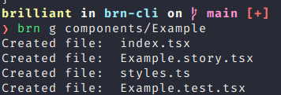
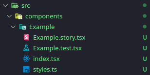

# brn cli

[](http://commitizen.github.io/cz-cli/)
[](https://opensource.org/licenses/MIT)
[](https://storybook.js.org/)
[](https://github.com/Bryant-Anjos/brn-cli/actions/workflows/tests.yml)
[](https://github.com/Bryant-Anjos/brn-cli/actions/workflows/npm.yml)

A cli to generate react native files created to be used together with [template expo with paper](https://github.com/Bryant-Anjos/template-expo-with-paper)

## Instalation

```bash
yarn global add brn-cli
```

or

```bash
npm i -g brn-cli
```

## Usage

- `generate|g <name>`  
it creates inside the src directory 4 files, they are a index component file, a styles file, a test file and a story file.

```bash
brn generate path/to/file
```

or

```bash
brn g path/to/file
```

|Usage|Generated files|
|---|---|
|||
